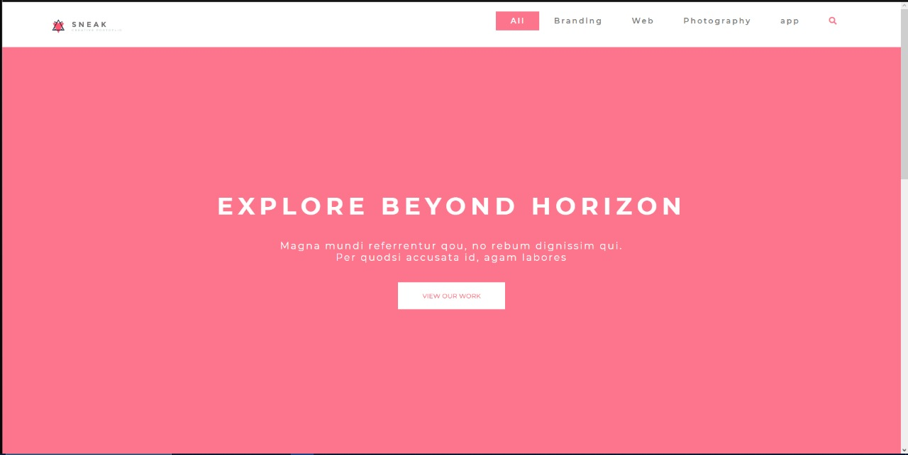
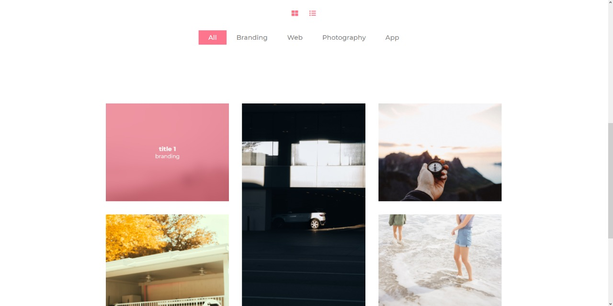
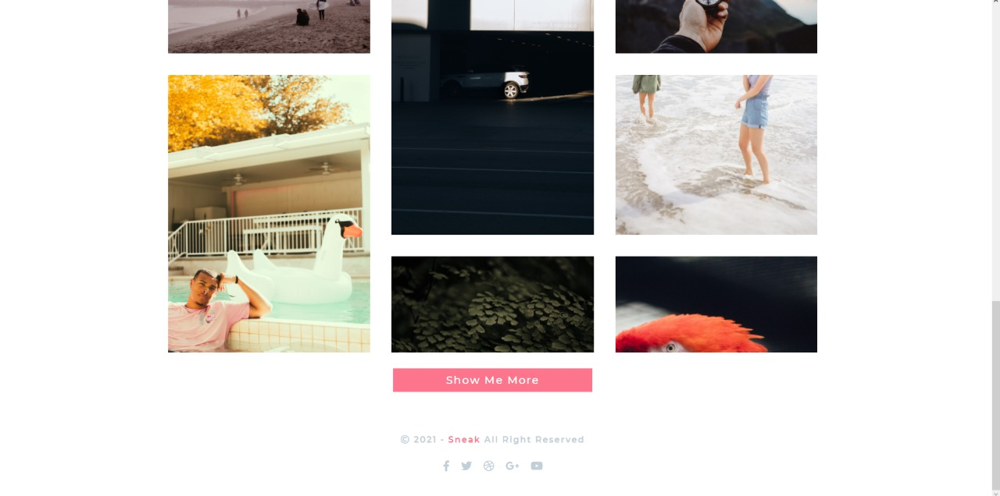
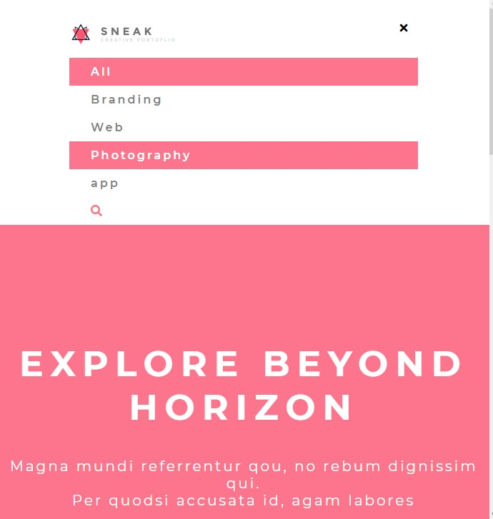
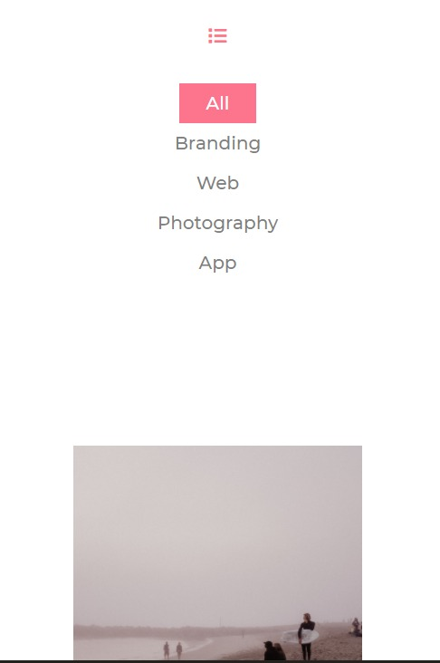

<h1>SNEAK APP</h1>

    </img>

<h1>Como Correr el proyecto</h1>
<ul>
<li>Clonar el repositorio </li>
<li>Abrir el archivo index.html en el navegador </li>
</ul>

<h1>RESUMEN</h1>

    La pagina cuenta con un tag de opciones la cual se puede filtar las imagenes segun el tipo.

    </img>

    Un boton de show me more, el cual despliega el contenedor de las cards par apoder verlas todas completas

    </img>

<h1>RESPONSIVE</h1>

    La aplicacion cuenta con responsive web la cual parte de los 700px y 400px para una mejor experiencia de usuario:

    menu nav mobile

    </img>

    tag de opciones

    </img>

    <h1> TECNOLOGIAS USADAS </h1>
        <h2>FRONTEND</h2>
        <ul>
            <li>HTML5 </li>
            <li>CSS</li>
            <li>Java Script</li>
        </ul>

